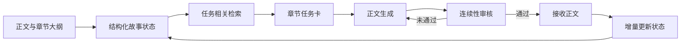

# Novel Continuity Memory Agent

面向长篇小说续写的可插拔连续性记忆 Agent。系统将固定设定、人物状态、场景、章节末态、未解决事项和伏笔写入结构化状态库，并在每次续写时按任务检索必要信息，避免持续携带全部历史正文。

## 实验结果

### 整书上下文与检索上下文对照

在同一小说、相同基础 Agent 和相同章节范围下，两组各连续生成第5—65章，共122章。

- 输入Token从27,178,732降至7,141,354，减少73.72%。
- 总Token从27,641,893降至7,868,256，减少71.53%。
- V2.0十项一致性均分从90.160提升至91.918，提高1.758分。
- 全程评分标准差从4.271降至2.531。
- 后20章评分标准差从4.595降至2.346。


### WebNovelBench多题材泛化实验

实验覆盖20种题材、60本小说，每本导入前4章并续写本地第5—10章，共生成和评分360章。

- 360章V2.0十项一致性均分为86.66/100。
- 六个续写位置均分保持在86.10—87.05之间。
- 后3章相对前3章仅下降0.27分。
- 输入Token中位数由41,435逐步增长至68,988，没有持续加速或突然上冲。
- 续写5与续写6的输入Token中位数仅变化0.25%，短程增长受控且末段基本稳定。


## 工作流程



## 核心能力

- 导入Markdown或TXT正文与章节大纲。
- 提取固定设定、人物、场景、章节末态、未解决事项和伏笔。
- 按章节任务检索最小必要上下文。
- 生成章节任务卡与正文草稿。
- 使用AI审核事实、人物、状态、空间、时间、衔接、因果、伏笔、大纲边界和叙事节奏。
- 支持自动重写、状态更新、章节级断点续跑和失败恢复。
- 独立运行质量评估，评分不反向修改实验正文。
- 汇总逐章Token和V2.0一致性评分，输出CSV与趋势图。

## 项目结构

```text
novel-continuity-memory-agent/
├─ novel_memory_agent/         Agent核心实现
├─ skills/                     连续性记忆与质量评估Skill
├─ scripts/                    基准实验、泛化实验与汇总脚本
├─ tests/                      自动化测试
├─ examples/                   最小示例正文与大纲
├─ reports/                    脱敏后的聚合实验结果
├─ configs/                    配置示例
├─ docs/                       实验设计与复现说明
├─ app.py                      Streamlit界面
└─ pyproject.toml              Python项目配置
```

## 快速开始

要求Python 3.11—3.13。

```powershell
git clone <your-repository-url>
cd novel-continuity-memory-agent
python -m pip install -e ".[dev]"
$env:DEEPSEEK_API_KEY = Read-Host "请输入 DeepSeek API Key"
python -m streamlit run app.py
```

API Key只从环境变量或当前应用会话读取，不应写入配置文件或提交到版本控制。

## CLI示例

创建项目并导入示例材料：

```powershell
python -m novel_memory_agent.cli create "雨夜旅店测试"
python -m novel_memory_agent.cli import 1 `
  --manuscript ".\examples\sample_manuscript.md" `
  --outline ".\examples\sample_outline.md"
```

初始化V2故事状态：

```powershell
python -m novel_memory_agent.cli state-init 1 --through-chapter 2
```

连续性记忆Skill也可以作为独立入口使用：

```powershell
python ".\skills\novel-continuity-memory\scripts\novel_skill.py" doctor `
  --db ".\data\novel_memory.db" --novel-id 1
```

## 测试

```powershell
python -m pytest
```

当前测试集覆盖数据库、解析、检索、Agent、CLI、质量评估和WebNovelBench数据处理。

## 实验复现

- [实验数据与复现说明](docs/experiments.md)
- [双方案技术诊断报告](reports/baseline/V2.1双方案技术诊断报告.md)
- [多题材泛化实验说明](reports/generalization/泛化实验简化数据说明.md)

仓库不包含原始小说、生成正文、SQLite数据库或API调用日志。聚合后的Token、评分和图表可直接查阅。

## 数据来源与许可

泛化实验使用[WebNovelBench](https://github.com/OedonLestrange42/webnovelbench)，原数据采用CC BY-NC-SA 4.0许可。请从原项目获取数据并遵守其许可条款。本仓库只分发聚合指标，不重新分发小说正文。

本仓库代码采用MIT License，详见[LICENSE](LICENSE)。
