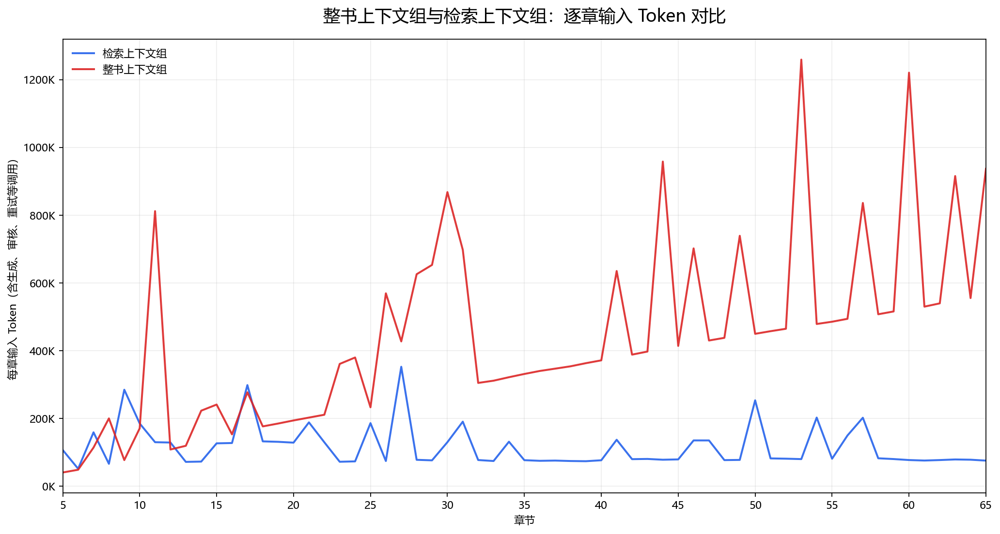
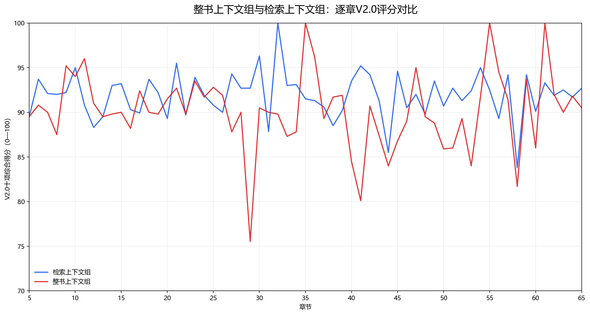

# V2.1长篇小说上下文方案技术诊断报告

## 1. 摘要

本实验在同一部长篇小说、相同章节范围和相同基础Agent下，对比两种上下文方案：

- **检索上下文组**：每章按任务需要检索结构化状态、相关记忆和必要前文。
- **整书上下文组**：每章携带此前累计的完整正文上下文。

两组均生成第5—65章，共61章。检索组取得更高的V2.0十项平均分和更低的逐章评分波动。整书方案的输入Token随章节推进明显增长；检索方案的输入规模整体保持稳定。

当前基准实验只覆盖一部小说，因此结论能够证明本案例中的Token与评分稳定性差异，但不能单独证明跨题材泛化能力。跨题材结论由后续WebNovelBench多题材实验验证。

## 2. 实验口径

| 项目 | 统一设置 |
|---|---|
| 生成范围 | 第5—65章 |
| 每组生成章节数 | 61章 |
| 基础模型与Agent | 相同 |
| 目标字数与章节规则 | 相同 |
| 质量评价 | V2.0十项百分制，每章独立评分 |
| 评分后处理 | 只记录分数，不判定通过或失败，不触发重写 |
| Token统计 | API usage逐次记录，包含生成、审核及重试 |

## 3. V2.0十项评分细则

每项取0—100分，V2.0综合分为十项算术平均。评分器只输出量化分数，不输出评价、修改意见或通过/失败结果。

| 评分维度 | 核查内容 |
|---|---|
| 事实一致性 | 身份、关系、经历、物品和已经发生的事件是否与历史信息冲突 |
| 人物一致性 | 人物动机、性格、语言、能力及知情范围是否合理，是否发生人物崩坏 |
| 状态一致性 | 身体、情绪、物品持有和人物关系的变化是否在后续得到正确延续 |
| 空间一致性 | 地点名称、方位、归属、距离和人物移动路径是否正确 |
| 时间一致性 | 日期、时辰、持续时间及事件先后顺序是否合理 |
| 章节衔接 | 上一章的结尾状态是否被本章开头准确、自然地承接 |
| 跨章因果 | 当前事件是否由上游原因自然引发，并对后续产生合理结果 |
| 伏笔一致性 | 已有伏笔是否被保留，是否存在错误回收或提前泄露 |
| 大纲边界 | 是否完成当前章节目标，有无遗漏任务或提前写出后续剧情 |
| 叙事节奏 | 重点情节篇幅、冲突升级速度和章节信息密度是否合理 |

统一分数锚点：90—100为稳定优秀；80—89为整体良好；70—79为基本成立但存在明显不足；60—69为多处问题影响阅读；0—59为基本不可用。锚点仅用于统一裁判尺度，实验报告不把它转换成验收结论。

若提供原作对应章节，评估器还可单独记录“原作剧情功能匹配分”，衡量核心事件功能是否相近。该指标不改变V2.0十项综合分；本次两组基准实验未提供原作对照，因此不统计该项。

## 4. Token结果

| 指标 | 检索上下文组 | 整书上下文组 | 差异 |
|---|---:|---:|---:|
| API调用次数 | 383 | 276 | 整书组少107次 |
| 输入Token | 7,141,354 | 27,178,732 | 整书组多20,037,378 |
| 输出Token | 726,902 | 463,161 | 整书组少263,741 |
| 总Token | 7,868,256 | 27,641,893 | 整书组为3.51倍 |

虽然整书组API调用次数更少，但每次调用携带的历史正文越来越长，使其输入Token达到检索组的3.81倍，总Token达到3.51倍。调用次数本身不能代表上下文规模，输入内容长度才是主要差异来源。

### 4.1 随章节增长的Token趋势

使用第5—65章的逐章数据进行一元线性拟合：

| 拟合口径 | 检索上下文组 | 整书上下文组 | 两组斜率差 |
|---|---:|---:|---:|
| 全部调用输入Token斜率 | -827 Token/章 | +10,108 Token/章 | +10,935 Token/章 |
| 首次通过章节输入Token斜率 | +229 Token/章 | +8,670 Token/章 | +8,441 Token/章 |

“首次通过章节”排除了不同重写次数对曲线的干扰，更适合观察上下文本身的增长。其结果表示：小说每向后推进一章，整书上下文方案的单章输入量平均增加约8,670 Token，检索方案仅增加约229 Token。相对于检索方案，整书方案每后移一个章节位置，输入Token平均额外增加约8,441。

## 5. 质量与稳定性结果

| 指标 | 检索上下文组 | 整书上下文组 | 检索组相对表现 |
|---|---:|---:|---:|
| 61章平均分 | 91.918 | 90.160 | +1.758 |
| 最低分 | 83.800 | 75.550 | +8.250 |
| 最高分 | 100.000 | 100.000 | 持平 |
| 全程评分总体标准差 | 2.531 | 4.271 | 低1.740 |
| 第46—65章平均分 | 91.705 | 90.540 | +1.165 |
| 第46—65章评分总体标准差 | 2.346 | 4.595 | 低2.249 |
| 前20章至后20章均分变化 | -0.081 | -0.606 | 检索组下降更少 |

标准差越低，说明逐章质量波动越小。检索组不仅平均分更高，其最低分、全程标准差和后20章标准差也均优于整书组。尤其在后20章，整书组的波动约为检索组的1.96倍，说明增加完整上下文并未在本案例中换来更稳定的质量。

## 6. 技术结论

1. **上下文规模近似受控。** 检索组首次通过章节的输入增长仅约229 Token/章；整书组约为8,670 Token/章。
2. **整体Token显著减少。** 相比整书组，检索组输入Token从27,178,732降至7,141,354，减少73.72%；总Token从27,641,893降至7,868,256，减少71.53%。
3. **质量没有因压缩上下文而下降。** 检索组V2.0平均分反而高1.758分。
4. **长程稳定性更好。** 检索组后20章标准差低2.249分，且前后期均分基本持平。
5. **整书上下文存在扩展性风险。** 随小说增长，其单章输入Token持续增加，同时质量波动未相应改善。

在本次单书基准实验中，结构化状态与按需检索能够以更少的Token维持、并略微提升长篇续写的一致性与稳定性。因此，检索上下文方案适合作为基础Agent上的可插拔长篇记忆Skill；后续仍需通过多题材、多样本实验检验该趋势是否能够泛化。

### 简历版量化结论

> 通过结构化状态与按需检索，将长篇续写的输入Token降低73.72%、总Token降低71.53%，同时V2.0一致性评分提升1.758分。

## 7. 数据文件

- `chapter_token_metrics.csv`：两组逐章Token明细。
- `chapter_input_token_comparison.png`：两组逐章输入Token曲线。
- `chapter_score_comparison.png`：两组逐章V2.0评分曲线。
- `chapter_score_comparison.csv`：两组逐章评分明细。
