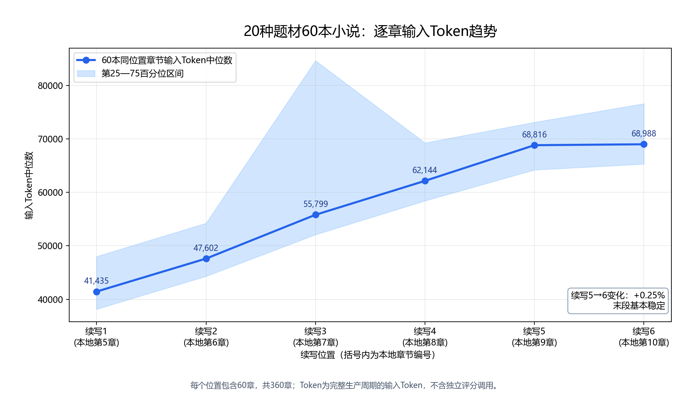
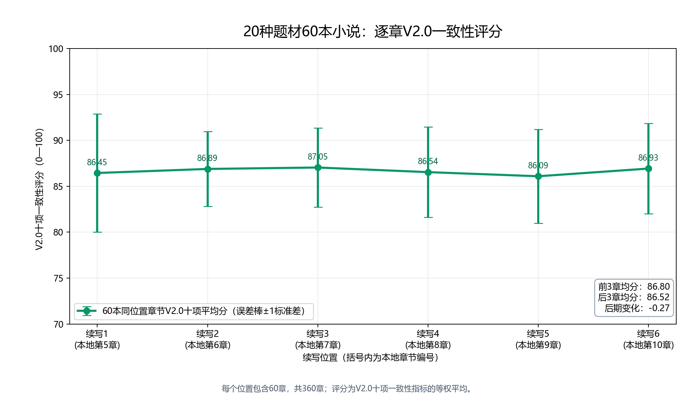

# V2.1 Agent 泛化实验数据说明

## 1. 数据范围

本分析只使用最终完整泛化实验数据：20种题材、60本小说，每本续写本地第5—10章，共360章。每本书的六章统一映射为续写位置1—6，因此每个位置包含60章观测。

分析只使用两个指标：完整生产周期的每章输入Token，以及每章V2.0十项一致性评分。四个Stage仅表示样本逐步扩展，最终结果按完整的60本书汇总。

## 2. 六个续写位置汇总

| 续写位置 | 本地章节 | 样本数 | 输入Token中位数 | 第25—75百分位区间 | V2.0平均分 | 评分标准差 |
|---|---:|---:|---:|---:|---:|---:|
| 续写1 | 第5章 | 60 | 41,435 | 38,141—47,997 | 86.45 | 6.42 |
| 续写2 | 第6章 | 60 | 47,602 | 44,303—54,217 | 86.89 | 4.06 |
| 续写3 | 第7章 | 60 | 55,799 | 52,092—84,630 | 87.05 | 4.30 |
| 续写4 | 第8章 | 60 | 62,144 | 58,415—69,246 | 86.54 | 4.91 |
| 续写5 | 第9章 | 60 | 68,817 | 64,202—73,103 | 86.10 | 5.12 |
| 续写6 | 第10章 | 60 | 68,988 | 65,295—76,583 | 86.93 | 4.92 |

## 3. 输入Token

输入Token中位数从续写1的41,435逐步增长至续写5的68,817，续写6为68,988，最后两个位置仅相差0.25%。续写3的第75百分位明显升高，说明部分书在该位置发生了较多审核、重写或状态处理调用；中位数没有出现同等幅度的尖峰。

这组结果表明Token并非保持不变，而是在前五个续写位置逐步增长，到续写5—6趋于平缓。中位数曲线没有出现持续加速或突然上冲，因此更准确的表述是“短程Token增长受控，末段基本稳定，没有出现失控增长”。

## 4. 每章评分

360章V2.0十项一致性评分总体均值为86.66，标准差为5.02。六个续写位置的平均分处于86.10—87.05之间，最大差距不足1分。前3个位置平均86.80，后3个位置平均86.52，后期变化为-0.27分。

评分折线没有出现随续写推进持续下降的趋势。因此，在每本连续续写6章的实验窗口内，Agent在20种题材上的一致性评分总体稳定。

## 5. 简化结论

在20种题材、60本小说、360章的泛化实验中，每个续写位置均由60章数据支撑。Agent的输入Token中位数从41,435逐步增长至68,988，没有出现持续加速或突然上冲，且续写5—6仅变化0.25%，说明短程Token增长受控并在末段基本稳定；同时，六个位置的V2.0一致性评分始终稳定在86.10—87.05之间，后3章相对前3章仅下降0.27分。

这组数据支持Agent在多题材环境下保持稳定的短程生成质量，并呈现可观察、可量化的Token增长规律。由于每本只续写6章，本实验不进一步推断数十章或百章级长期Token趋势。
